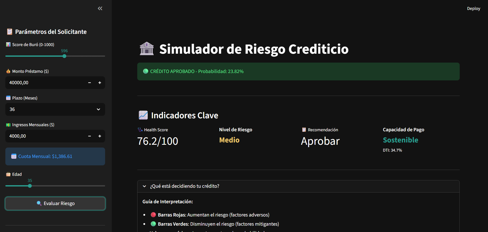
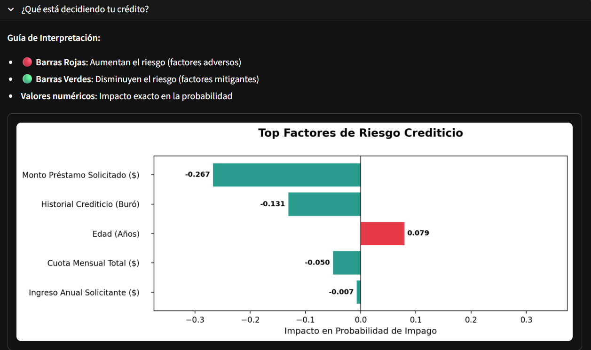
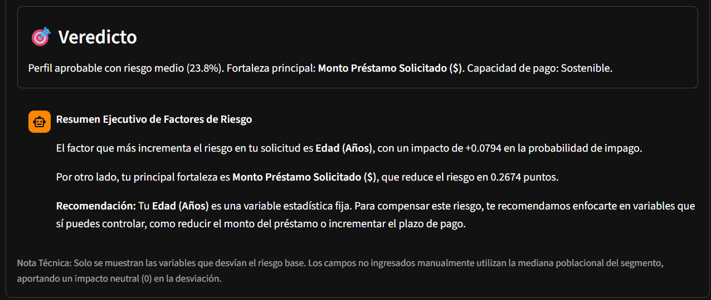

<div align="center">

# 🚀 Simulador de Riesgo Crediticio con IA Prescriptiva

[](https://www.python.org/)
[](https://streamlit.io/)
[](https://lightgbm.readthedocs.io/)
[](https://shap.readthedocs.io/)
[](https://scikit-learn.org/)

---

### 💡 Sistema de Inteligencia Crediticia de Nueva Generación

**No solo predice el "No" — encuentra el "Sí" alternativo.**

</div>

---

## 📋 Descripción

### ¿Qué hace este sistema?

Este simulador de riesgo crediticio es un **motor de análisis prescriptivo** que va más allá de la predicción tradicional. A diferencia de los modelos convencionales que simplemente clasifican una solicitud como "aprobada" o "rechazada", nuestro sistema implementa un **Motor de Rescate Secuencial** que evalúa automáticamente alternativas viables cuando la solicitud original presenta alto riesgo.

### ¿Cómo funciona?

Cuando el modelo de Machine Learning (LightGBM) detecta que una solicitud supera el umbral de riesgo del 30%, el sistema no se detiene ahí. En su lugar, ejecuta una **simulación secuencial** que prueba combinaciones de plazos y montos:

1. **Escalera de Plazos**: Evalúa extensiones progresivas (12 → 24 → 36 → 48 → 60 meses)
2. **Ajuste de Monto**: Si ningún plazo funciona al 100%, reduce el monto al 70%
3. **Veredicto Final**: Presenta la primera combinación viable o emite un rechazo justificado

### ¿Por qué es diferente?

| Modelo Tradicional | Nuestro Sistema |
|-------------------|-----------------|
| "Su solicitud fue rechazada" | "Podemos ofrecerle un crédito de $X a Y meses" |
| Análisis binario | Simulación de escenarios múltiples |
| Caja negra | Explicabilidad completa con SHAP |
| Sin alternativas | Motor prescriptivo de rescate |

---

## 🖥️ Capturas de Pantalla

### Dashboard de Salud Crediticia
<!-- Placeholder para captura del dashboard de KPIs -->
<div align="center">

<p><em>Indicadores clave: Health Score, Nivel de Riesgo, Capacidad de Pago, Recomendación</em></p>
</div>

### Análisis de Factores (SHAP) - Interpretación Humana
<!-- Placeholder para captura del análisis SHAP -->
<div align="center">

<p><em>Factores consolidados con narrativa ejecutiva generada automáticamente</em></p>
</div>

### Recomendación de Escenario Viable
<!-- Placeholder para captura del veredicto -->
<div align="center">

<p><em>Motor prescriptivo: Cuando la solicitud original es rechazada, el sistema propone alternativas</em></p>
</div>

---

## 🏗️ Arquitectura del Proyecto

```
credit-risk-analytics/
├── app/                    # 🎯 Interfaz de Usuario (Streamlit)
│   ├── main.py            # Punto de entrada principal
│   └── __init__.py
├── src/                    # 🔧 Pipeline de Machine Learning
│   ├── data_ingestion.py  # Ingesta desde PostgreSQL
│   ├── preprocessing.py   # Limpieza y transformación
│   ├── model_training.py  # Entrenamiento LightGBM
│   ├── prescriptive_engine.py  # Motor de simulación What-If
│   ├── explainability.py  # Análisis SHAP
│   └── train_model.py     # Pipeline completo
├── utils/                  # ⚙️ Configuración Centralizada
│   ├── config.py          # Constantes y mapeos
│   └── __init__.py
├── models/                 # 🧠 Artefactos del Modelo
│   ├── modelo_riesgo.pkl  # Modelo serializado
│   └── feature_medians.json  # Medianas para inferencia
├── .streamlit/             # 🎨 Configuración UI
│   └── config.toml        # Tema oscuro profesional
├── docs/                   # 📚 Documentación
├── AGENTS.md              # 🤖 Directrices para IA
└── requirements.txt       # 📦 Dependencias
```

---

## 🚀 Instalación y Uso

### Requisitos Previos
- Python 3.10 o superior
- Git
- (Opcional) PostgreSQL para datos reales

### Paso 1: Clonar el repositorio
```bash
git clone https://github.com/anthony/credit-risk-analytics.git
cd credit-risk-analytics
```

### Paso 2: Crear entorno virtual
```bash
python -m venv venv
source venv/bin/activate  # Linux/Mac
# venv\Scripts\activate   # Windows
```

### Paso 3: Instalar dependencias
```bash
pip install -r requirements.txt
```

### Paso 4: Ejecutar la aplicación
```bash
streamlit run app/main.py
```

### Paso 5: Abrir en navegador
La aplicación estará disponible en `http://localhost:8501`

---

## 📊 Características Principales

- [x] **Bloqueo de DTI**: Validación automática de relación cuota/ingreso (máximo 45%)
- [x] **IA LightGBM**: Modelo de gradient boosting para predicción de impago
- [x] **Análisis SHAP**: Explicabilidad completa de cada decisión crediticia
- [x] **Motor de Rescate Secuencial**: Búsqueda automática de alternativas viables
- [x] **Políticas Bancarias**: Cumplimiento de regulaciones institucionales
- [x] **Dashboard de KPIs**: Health Score, Nivel de Riesgo, Capacidad de Pago
- [x] **Narrativa Ejecutiva**: Interpretación humana automática de resultados
- [x] **Interfaz Profesional**: Tema oscuro con visualizaciones interactivas

---

## 🔧 Tecnologías Utilizadas

| Categoría | Tecnología | Uso |
|-----------|------------|-----|
| **Lenguaje** | Python 3.10 | Desarrollo principal |
| **ML Framework** | LightGBM | Modelo de predicción |
| **Interpretabilidad** | SHAP | Explicabilidad del modelo |
| **Interfaz Web** | Streamlit | Aplicación interactiva |
| **Base de Datos** | PostgreSQL | Almacenamiento de datos |
| **Visualización** | Matplotlib, Seaborn | Gráficos y dashboards |
| **Pipeline** | Scikit-learn | Preprocesamiento |
| **Testing** | Pytest | Aseguramiento de calidad |

---

## 📈 Métricas del Modelo

| Métrica | Valor | Descripción |
|---------|-------|-------------|
| **ROC-AUC** | 0.7478 | Área bajo la curva ROC |
| **Features** | 183 | Variables utilizadas después de purga |
| **Tasa de Default** | 8.1% | Porcentaje de impago en datos |
| **DTI Máximo** | 45% | Política de relación cuota/ingreso |
| **LTI Máximo** | 5x | Política de relación préstamo/ingreso |

---

## 📁 Nota sobre Datos

**El dataset original de Home Credit (2.29 GB) se encuentra disponible en:**
🔗 [Kaggle: Home Credit Default Risk](https://www.kaggle.com/c/home-credit-default-risk)

Debido a las limitaciones de tamaño de GitHub (100MB por archivo), el dataset no está incluido en este repositorio. Para replicar el entrenamiento:

1. Descargar el dataset desde Kaggle
2. Colocar los archivos en la carpeta `Dataset/` (creada automáticamente)
3. Ejecutar `python src/train_model.py` para reentrenar el modelo

**En producción, el sistema se conecta directamente a PostgreSQL para obtener datos en tiempo real.**

---

## 🤝 Créditos

<div align="center">

**Desarrollado por Anthony**  
*Data Analyst / Fintech Engineer*

[](https://github.com/anthony)
[](https://linkedin.com/in/anthony)

</div>

---

## 📝 Licencia

Este proyecto es de uso educativo y demostrativo.  
Todos los derechos reservados © 2026.

---

<div align="center">

**⭐ Si este proyecto te fue útil, dale una estrella en GitHub ⭐**

*Última actualización: Marzo 2026*

</div>